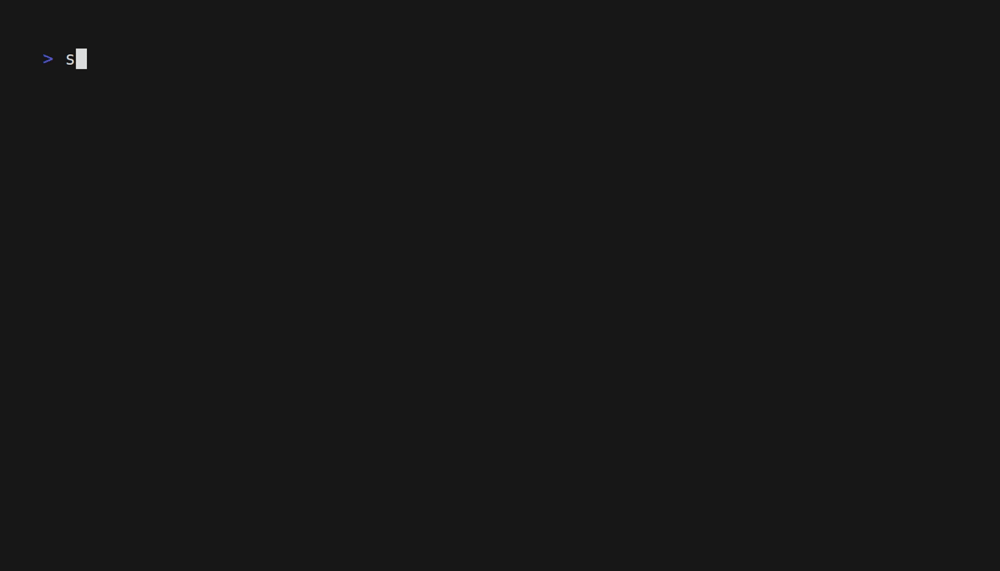
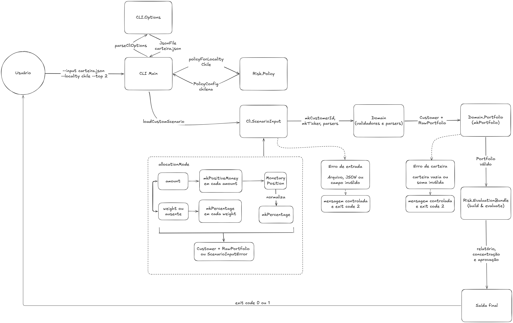

# Type-Safe Portfolio Compliance Engine

Motor de compliance para carteiras de investimento, desenvolvido em Haskell como projeto da disciplina de Desenvolvimento Guiado por Tipos

## Visão geral

O projeto recebe uma carteira de investimentos, valida sua estrutura por meio
de tipos seguros e aplica regras de compliance, risco, suitability,
concentração e aprovação operacional.

Principais capacidades:

- Construção type-safe de valores financeiros e carteiras válidas.
- Regras configuráveis por perfil, score, segmento e localidade.
- Workflow de aprovação com Phantom Types e GADTs.
- Análise de concentração com vetores indexáveis, singletons e Top N dinâmico.
- Entrada por cenários compilados ou arquivos JSON.
- CLI com saída visual, fallback ASCII e códigos de saída previsíveis.

### Demonstração



### Primeiro comando

```bash
stack build
stack run portfolio-compliance-engine -- approved
```

Para validar o projeto inteiro:

```bash
stack test
```

### Sumário

- [Contexto](#1-contexto)
- [Problema](#2-problema)
- [Solução e arquitetura](#3-solução-e-arquitetura)
- [Modelagem de domínio](#4-modelagem-de-domínio)
- [Regras implementadas](#5-regras-implementadas)
- [Como executar](#6-como-executar)
- [Exemplos de saída](#7-exemplos-de-saída)
- [Garantias do sistema de tipos](#8-garantias-do-sistema-de-tipos)
- [Validações em runtime](#9-validações-em-runtime)
- [Testes](#10-testes)
- [Estrutura do projeto](#11-estrutura-do-projeto)
- [Relatório da entrega](#relatório-da-entrega)

## 1. Contexto

Carteiras de investimento precisam obedecer a regras de risco e
compliance, como limite por ativo, limite por setor, limite por classe
de ativo e diversificação mínima. Em abordagens com tipos primitivos
soltos, esses conceitos costumam circular como `String` e `Double`,
permitindo que estados inválidos avancem pelo sistema antes mesmo de a
camada de negócio ter chance de reagir.

## 2. Problema

Portanto, o problema/pergunta central que o projeto visa responder é: quais invariantes podem ser
garantidas pela própria estrutura dos tipos, e quais são regras de
negócio que realmente precisam ser avaliadas em runtime sobre uma
carteira já estruturalmente correta?

## 3. Solução e Arquitetura

O projeto separa o domínio em duas camadas complementares.

Invariantes de domínio, garantidas na construção:

- `Ticker` nunca é vazio.
- `Percentage` é sempre finito e está em `[0, 1]`; todos os caminhos públicos
  de construção rejeitam valores não finitos.
- `PositiveMoney` é sempre estritamente positivo e finito.
- `Portfolio` só existe quando a soma dos pesos fecha em 100%, dentro
  de uma tolerância explícita de ponto flutuante.

Regras de compliance e risco, avaliadas em runtime sobre um
`Portfolio` válido e uma política de avaliação:

- Nenhum ativo pode representar mais de 30% da carteira na política
  padrão, mas esse limite é configurável por segmento.
- Posições repetidas do mesmo ticker são agregadas antes da validação do
  limite por ativo, evitando que a concentração seja fragmentada para
  contornar a regra.
- Nenhum setor pode representar mais de 50% da carteira na política
  padrão, com suporte a variações por localidade e segmento.
- Criptomoedas não podem ultrapassar 10% da carteira na política
  padrão.
- Crédito privado não pode ultrapassar 20% da carteira na política
  padrão.
- O perfil do cliente pode impor limites ainda menores para cripto e
  crédito privado.
- A carteira precisa ter pelo menos 3 tickers distintos.

### Visão geral da arquitetura

O diagrama resume o caminho da entrada da CLI até a avaliação e a saída final.



## 4. Modelagem de Domínio

```text
Ticker          -- newtype sobre Text, nunca vazio
Percentage      -- newtype sobre Double, finito e sempre em [0, 1]
PositiveMoney   -- newtype sobre Double, sempre > 0 e finito
AssetClass      -- ADT fechado: Equity | FixedIncome | Crypto | PrivateCredit | Fund | Cash
Sector          -- ADT fechado: Financial | Energy | Utilities | Technology | Consumer | Other
Asset           -- ticker + classe + setor
Position        -- asset + weight
MonetaryPosition
    -- asset + PositiveMoney; normalizada para Position na entrada JSON
RawPortfolio    -- [Position] sem validação de soma
Portfolio       -- válido por construção, soma dos pesos ~= 100%
Violation       -- ADT estruturado, uma forma por regra violada
PolicyConfig    -- configuração tipada dos limites de compliance
PortfolioReport -- status + risk level + violações
ApprovalCase state
    -- wrapper type-safe para o estado do workflow de aprovação
Pending | AwaitingAnalyst | AwaitingManager | AwaitingCreditCommittee
Approved | Rejected
    -- estados fantasma usados somente pelo sistema de tipos
ApprovalEvaluation
    -- decisão runtime que carrega ApprovalCase com o estado correspondente
ApprovalTransition from to
    -- GADT que representa as transições válidas entre estados do workflow
ApprovalReport  -- decisão operacional renderizável + alçada
Vec n a
    -- vetor cujo comprimento participa do tipo
Fin n
    -- índice garantidamente válido para um vetor de tamanho n
SNat n
    -- testemunha runtime do natural n presente no tipo
SomeSNat
    -- wrapper existencial para algum natural descoberto em runtime
Top3Positions
    -- Vec N3 Position com as três maiores posições da carteira
SomeTopPositions
    -- wrapper existencial que mantém SNat n e Vec n Position relacionados
HList xs
    -- lista heterogênea cujo schema de tipos participa do tipo
ConcentrationEvidence mode
    -- request de concentração e resultado calculado para o mesmo modo
EvaluationBundle mode
    -- HList com os artefatos de uma única avaliação
RuleEvidence rule
    -- Open Type Family que associa cada regra ao seu tipo de evidência
RuleEvaluation rule
    -- evidência tipada e violações derivadas da mesma avaliação
ComplianceRule rule
    -- interface de uma regra executável de compliance
RuleInput rule
    -- tipo associado que declara a entrada exata da regra
```

## 5. Regras implementadas

| Regra | Limite | Módulo |
| --- | --- | --- |
| Limite por ativo | 30% | `Risk.Rules.AssetAllocation` |
| Limite por setor | 50% | `Risk.Rules.SectorExposure` |
| Limite por classe (cripto) | 10% | `Risk.Rules.AssetClassExposure` |
| Limite por classe (crédito privado) | 20% | `Risk.Rules.AssetClassExposure` |
| Diversificação mínima | 3 ativos distintos | `Risk.Rules.Diversification` |
| Suitability por perfil (cripto) | perfil-dependente | `Risk.Rules.CustomerSuitability` |
| Suitability por score (Equity/Crypto) | score-dependente | `Risk.Rules.CustomerSuitability` |
| Crédito privado por perfil | 5% / 15% / 25% | `Risk.Rules.PrivateCreditSuitability` |
| Política configurável por segmento | `RetailPolicy` / `PrivateBankingPolicy` | `Risk.Policy` |
| Política configurável por localidade | `Brazil` / `Chile` | `Risk.Policy` |
| Workflow de aprovação | alçada máxima por violação | `Risk.Approval` |

## 6. Como executar

```bash
stack build
stack test
stack run portfolio-compliance-engine -- approved
stack run portfolio-compliance-engine -- asset-allocation-risk
stack run portfolio-compliance-engine -- crypto-risk
stack run portfolio-compliance-engine -- private-credit-global
stack run portfolio-compliance-engine -- private-credit-profile
stack run portfolio-compliance-engine -- under-diversified
stack run portfolio-compliance-engine -- conservative-crypto
stack run portfolio-compliance-engine -- policy-retail
stack run portfolio-compliance-engine -- policy-private-banking
stack run portfolio-compliance-engine -- approved --locality brazil
stack run portfolio-compliance-engine -- approved --locality chile
stack run portfolio-compliance-engine -- approved --locality chile --top 2
stack run portfolio-compliance-engine -- --input examples/custom-portfolio.json
stack run portfolio-compliance-engine -- --input examples/custom-portfolio.json --locality chile --top 2
```

Sem argumentos, ou com um cenário desconhecido, o programa imprime a
lista de cenários válidos e sai com código `64`.

Os cenários `policy-retail` e `policy-private-banking` demonstram que a
mesma carteira pode ser aprovada ou rejeitada dependendo da política
aplicada, sem alterar a estrutura do `Portfolio`.

A CLI também aceita `--locality brazil` e `--locality chile` para os cenários
que usam a política default. O parser converte o texto para o tipo fechado
`Locality` antes de chamar `Risk.Policy.policyForLocality`. A opção pode aparecer antes ou depois de
`--top`, e uma localidade explícita é exibida como contexto no relatório.

### Avaliando uma carteira própria

Além dos cenários compilados de demonstração, a CLI aceita exatamente uma fonte
de entrada: um cenário embutido **ou** `--input <arquivo.json>`. O arquivo é
somente uma representação externa. Antes de o motor ser chamado, seus textos e
números passam por `mkCustomerId`, `mkTicker`, `parseAssetClass`, `parseSector`,
`mkPercentage` e, por fim, `mkPortfolio`.

```bash
stack run portfolio-compliance-engine -- --input examples/custom-portfolio.json
stack run portfolio-compliance-engine -- --input examples/custom-portfolio.json --locality brazil
stack run portfolio-compliance-engine -- --input examples/custom-portfolio.json --locality chile --top 2
```

O schema esperado é:

```json
{
  "name": "opcional e apenas descritivo",
  "customer": {
    "id": "cliente-001",
    "profile": "conservative",
    "creditScore": "high"
  },
  "portfolio": {
    "positions": [
      {
        "ticker": "PETR4",
        "assetClass": "Equity",
        "sector": "Energy",
        "weight": 0.30
      }
    ]
  }
}
```

`profile` aceita `conservative`, `moderate` ou `aggressive`; `creditScore`
aceita `low`, `medium` ou `high`, sem diferenciar maiúsculas de minúsculas.
`weight` é uma fração em `[0, 1]`, portanto `0.30` significa 30%, e não 30.
Classes e setores usam os mesmos parsers do domínio

#### Entrada por valor monetário

O campo `allocationMode` pode ser definido como `amount` para que a carteira
seja informada por valores absolutos. Nesse modo, cada posição exige `amount`
estritamente positivo e finito; a CLI converte esses valores em pesos
normalizados antes de chamar `mkPortfolio`.

```json
{
  "name": "custom-approved-by-amount",
  "customer": {
    "id": "customer-conservative-high",
    "profile": "conservative",
    "creditScore": "high"
  },
  "portfolio": {
    "allocationMode": "amount",
    "positions": [
      {"ticker": "PETR4", "assetClass": "Equity", "sector": "Energy", "amount": 30000},
      {"ticker": "ITUB4", "assetClass": "Equity", "sector": "Financial", "amount": 30000},
      {"ticker": "VALE3", "assetClass": "Equity", "sector": "Other", "amount": 20000},
      {"ticker": "WEGE3", "assetClass": "Equity", "sector": "Technology", "amount": 20000}
    ]
  }
}
```

Execute com:

```bash
stack run portfolio-compliance-engine -- --input test/fixtures/custom-approved-by-amount.json
stack run portfolio-compliance-engine -- --input test/fixtures/custom-approved-by-amount.json --locality chile
```

Os montantes acima produzem os mesmos pesos `0.30`, `0.30`, `0.20` e `0.20`
da entrada ponderada. O campo `weight` não deve ser misturado com `amount` no
mesmo modo

Valores zero, negativos, `NaN`, infinito ou soma que estoure a representação
finita são rejeitados antes da avaliação

Falhas de arquivo, JSON/schema, campo de domínio ou soma dos pesos retornam
código `2`; uma carteira válida que viole compliance retorna código `1`.

### Exit Codes

| Código | Significado |
| --- | --- |
| `0` | Carteira aprovada em todas as regras de compliance |
| `1` | Carteira rejeitada por violações de compliance |
| `2` | Falha ao ler ou construir a entrada antes da avaliação |
| `64` | Uso incorreto da CLI |

## 7. Exemplos de saída

Carteira reprovada por excesso de concentração:

```text
Portfolio Compliance Report

Status: Rejected
Risk Level: Medium

Violations:
- PETR4 allocation is 40%, above the 30% limit.
- ITUB4 allocation is 35%, above the 30% limit.
```

Carteira reprovada por exposição a cripto:

```text
Portfolio Compliance Report

Status: Rejected
Risk Level: Medium

Violations:
- Crypto exposure is 25%, above the 10% limit.
```

Carteira reprovada por suitability de crédito privado:

```text
Portfolio Compliance Report

Customer Profile: Conservative
Status: Rejected
Risk Level: Medium
Approval Decision: RequiresManualReview (CreditCommittee)
Required Level: CreditCommittee

Violations:
- Private Credit exposure is 15%, above the 5% limit for Conservative profile.
```

Mesma carteira, políticas diferentes:

```text
portfolio-compliance-engine -- policy-retail
Status: Rejected
Violations:
- Moderate customers cannot have crypto exposure above 5%.

portfolio-compliance-engine -- policy-private-banking
Status: Approved
No violations found.
```

## 7.1 Tabela de alçadas

| Sinal | Alçada |
| --- | --- |
| Sem violações | `Automatic` |
| Excesso por ativo | `Analyst` |
| Diversificação mínima | `Analyst` |
| Excesso por setor | `Manager` |
| Excesso global de cripto | `Manager` |
| Excesso global de crédito privado | `CreditCommittee` |
| Excesso por perfil em crédito privado conservador | `CreditCommittee` |

## 8. Garantias do sistema de tipos

- Não existe caminho público para construir `Ticker`, `Percentage` ou
  `PositiveMoney` sem passar pelos smart constructors correspondentes.
- `Percentage` possui construtor privado; `mkPercentage` e `clampPercentage`
  rejeitam `NaN` e infinitos, e o helper para literais internos não é exposto.
- Não existe caminho público para construir `Portfolio` sem passar por
  `mkPortfolio`.
- O motor de compliance não aceita lista crua de posições nem
  `RawPortfolio`; a assinatura de tipo exige `Portfolio`.
- `PortfolioReport` é construído a partir das violações reais
  encontradas pelo pipeline puro, e a relação entre `Approved` e lista
  vazia de violações também é verificada por propriedades de
  QuickCheck.
- O estado do workflow de aprovação participa do tipo por meio de
  `ApprovalCase state`.
- Um caso aguardando `Analyst`, `Manager` ou `CreditCommittee` não pode
  ser passado para a transição de outro nível.
- O construtor de `ApprovalCase` não é público; estados do workflow não
  podem ser forjados externamente sem passar pelas transições do módulo.
- As transições válidas são representadas pelo GADT
  `ApprovalTransition from to`.
- `applyTransition` aceita apenas um `ApprovalCase` compatível com o
  estado de origem da transição escolhida.
- As transições internas de classificação de `Pending` não são expostas,
  evitando bypass de `evaluateApprovalCase`.
- `Vec n a` carrega o comprimento no tipo e `Fin n` representa somente
  índices válidos para esse comprimento.
- `ConcentrationResult ('Static n)` reduz para `Vec n Position`, e
  `ConcentrationResult 'Dynamic` reduz para `SomeTopPositions`.
- Uma request estática não pode produzir um resultado dinâmico; uma request
  dinâmica não promete um `Vec N5 Position` concreto sem que esse tamanho tenha
  sido conhecido estaticamente.
- `EvaluationBundle mode` possui exatamente o schema heterogêneo declarado.
- `PortfolioReport`, `ConcentrationEvidence mode` e `ApprovalReport` não podem
  trocar de posição sem produzir outro tipo.
- A evidência preserva o mesmo `mode` da request e o resultado calculado por
  `ConcentrationResult mode`.
- `Top3Positions` contém exatamente três posições; seus três acessores são
  totais depois da construção bem-sucedida da visão.
- `SNat n` conecta a cardinalidade no tipo ao valor runtime usado por
  `takeVec` e `topNPositions`, sem literais de tamanho duplicados.
- `SomeSNat` esconde o natural concreto descoberto em runtime, preservando sua
  testemunha `SNat n`.
- `SomeTopPositions` impede que uma testemunha e um vetor de tamanhos distintos
  sejam empacotados juntos.

### Testes negativos de tipos

Os testes negativos em `test/CompileFail/TypeSafetySpec.hs` usam
`should-not-typecheck` para verificar expressões que devem ser rejeitadas pelo
GHC. A aplicação e os demais testes continuam compilando normalmente.

Os testes cobrem quatro garantias principais:

- uma revisão de Analyst não aceita um caso de Credit Committee;
- uma transição GADT não pode receber um estado de origem diferente;
- um `Fin n` incompatível não pode indexar um `Vec n`;
- um resultado dinâmico de concentração não pode ser usado em um request
  estático.

## 9. Validações em runtime

- As seis avaliações de compliance e suitability em si, porque fazem parte
  da política de risco, não da validade estrutural do dado.
- A escolha da `PolicyConfig`, porque a mesma carteira pode ser válida
  ou inválida dependendo do segmento ou da localidade avaliada.
- As regras de suitability por perfil, score de crédito e os limites de
  crédito privado, porque dependem da política de risco aplicada a uma
  carteira já válida e, no caso do perfil e do score, também do cliente.
- Tickers duplicados na carteira: `mkPortfolio` aceita as posições, a regra
  de diversificação conta tickers distintos e a regra de alocação agrega a
  exposição total por ticker antes de comparar com o limite.
- O nível de risco agregado (`Low`, `Medium`, `High`), porque ele é uma
  política de interpretação das violações, não uma propriedade
  estrutural do portfólio.
- Determinar se uma carteira possui ao menos três posições e ordená-las por
  peso, antes de construir `Top3Positions`.
- O valor textual de `--top`, sua conversão para inteiro e a verificação de que
  a carteira possui posições suficientes para a solicitação dinâmica.
- Os valores concretos de relatório, violações, concentração e decisão de
  aprovação reunidos no `EvaluationBundle`.
- Política aplicada, perfil do cliente, exposições observadas, limites e a
  decisão de cada `RuleEvaluation`.

## 10. Testes

A suíte reúne três tipos de verificação:

- Sistema de tipos para impedir estados inválidos por construção.
- Testes unitários baseados em exemplo para comportamentos específicos.
- Testes de propriedade com QuickCheck para invariantes universais do
  domínio.

Para rodar a suíte completa:

```bash
stack test
```

Para executar a bateria de 30 arquivos JSON pela fronteira real do executável,
validando código de saída, status, risco, alçada e erros de entrada:

```bash
bash scripts/run-scenario-battery.sh
```

Os mesmos 30 fixtures também são cobertos pelo `Cli.ScenarioBatterySpec` e
rodam dentro de `stack test`. O script separado complementa o teste HSpec ao
invocar o executável compilado com `stack exec`.

## 11. Estrutura do projeto

```text
type-safe-portfolio-compliance-engine/
|-- app/Main.hs
|-- examples/
|   |-- concentrated.json
|   `-- custom-portfolio.json
|-- src/
|   |-- Cli/         -- parsing da CLI e adaptação de entrada JSON
|   |-- Domain/      -- tipos primitivos e modelagem financeira
|   |-- Examples/    -- cenários prontos para CLI
|   `-- Risk/        -- regras, política, relatório e agregação de risco
|-- test/
|   |-- Cli/         -- parser e bateria de cenários JSON
|   |-- CompileFail/ -- garantias negativas verificadas pelo compilador
|   |-- Domain/
|   |-- Examples/
|   |-- Generators/  -- geradores de QuickCheck
|   |-- Risk/
|   |-- fixtures/
|   |   |-- battery/ -- 30 fixtures JSON
|   |   `-- custom-*.json
|   `-- Spec.hs
|-- scripts/
|   `-- run-scenario-battery.sh
```